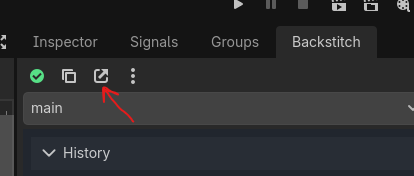
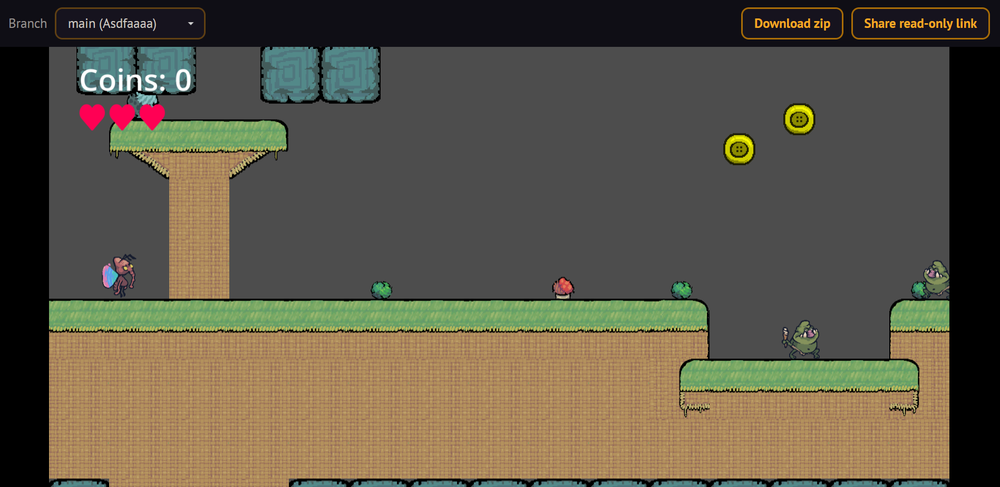

# Backstitch Webviewer

The Backstitch Webviewer lets you play games using the Godot plugin [Backstitch](https://backstitch.dev/) instantly in your browser.

Connects to the the [Backstitch Sync Server](https://github.com/inkandswitch/backstitch-sync-server), and renders the data!

## Features

While working with a Backstitch server that provides the Webviewer, press the "Copy playable web link" button in the Backstitch Sidebar.



Then, if you paste the URL into your browser, you'll be greeted with your game, playing directly in the Web! Your game will sync up to the branch you copied the URL from. If you'd like to see your changes, make sure to refresh the page.



To switch branches, you can use the "Branch" dropdown.

Alternatively, if you click the "Share read-only link" button, you can copy a special link that doesn't expose your Project ID or your other branches. Note that this isn't cryptographically secure -- someone can still reverse engineer your original project ID. But, it prevents anyone from just pasting it into their Backstitch client!

## Hosting

The Backstitch Webviewer has an Alpha Test Server-compatible instance set up at [alpha.backstitch.dev](https://alpha.backstitch.dev/). For custom servers, we recommend hosting it yourself, since anyone can access the Alpha Test Server.

For more information on how to host the Webviewer and connect it with the server, please visit the [Backstitch Sync Server](https://github.com/inkandswitch/backstitch-sync-server) repository.

For manual configuration or additional information, read on!

## Docker

This repo provides a simple Docker image that will write the frontend into a Docker volume:

```yaml
services:
    backstitch-webviewer:
        # Make sure not to set "restart" on this, since it's a static image
        # that fills a volume!
        image: ghcr.io/inkandswitch/backstitch-webviewer:latest
        environment:
            # This is the API URL that the frontend will query.
            # If your Backstitch server is hosted separately,
            # insert an absolute URL here to the API root.
            # Alternatively, if the Webviewer is being served from the
            # server root, you can just set this to "/".
            BACKSTITCH_API_URL: "https://example.com/"
        volumes:
            # This volume will be overwritten to contain the contents 
            # of /dist on startup.
            - webviewer:/site

volumes:
    webviewer:
```

This allows to easily pass the desired frontend to the Sync Server. See the [Backstitch Sync Server repository](https://github.com/inkandswitch/backstitch-sync-server) for more details on this configuration. 

## Without Docker

The sync server is a static site that can be served nearly anywhere that provides a static filesystem server!

Without Docker, you can easily use the frontend release on the [Releases](https://github.com/inkandswitch/backstitch-webviewer/releases) page. 

However, you'll need to set the API URL for the intended Backstitch Sync Server manually. In order to do so, edit `config.js` to contain:

```js
window.BACKSTITCH_API_URL = "<YOUR URL HERE>";
```

See the Docker instructions for information on what to use as your API URL.


## Developing

Contributions are welcome!

For local developer builds, install `node.js` and `npm`, run `npm install`, and `npm run dev` to run a local Vite instance. By default, it will set the API URL to the Alpha Test Server, but this can be overridden with environment variables. See `package.json` for more details. 